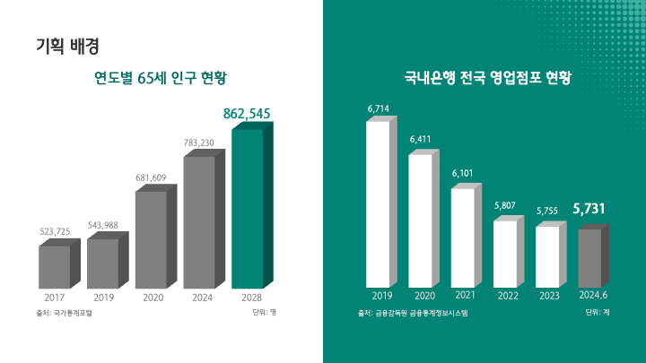

# 내 삶의 2막을 설계하다, HANAinPLAN
하나금융티아이 채용연계형 교육생 주소영: 최종 프로젝트

  

## 목차
[1. 프로젝트 소개](#1-프로젝트-소개)  
[2. 기획 배경](#2-기획-배경)  
[3. 기능 소개](#3-기능-소개)  
[4. 주요 기능](#4-주요-기능)  
[5. 서비스 아키텍처](#5-서비스-아키텍처)  
[6. 주요 기술](#6-주요-기술)  
[7. 시스템 아키텍처](#7-시스템-아키텍처)  
[8. 개발자 프로필](#8-개발자-프로필-)

## 1. 프로젝트 소개
은퇴한 하나인들을 위한 통합 자산관리 플랫폼, 하나인플랜  
분산된 금융자산을 한 곳에서 관리하고, 전문가와의 비대면 상담을 통해 개인형IRP 자산을 운용해 보세요!

[목차로](#목차)

## 2. 기획 배경

|  |  |
|:--:|:--:|

**은퇴자는 늘고, 창구는 줄어들다.**  
베이비 붐 세대의 은퇴로, 대한민국은 빠르게 초고령 사회로 진입하고 있습니다. 2028년에는 65세 이상 인구가 전체 인구 20%를 넘어설 전망이지만, 이들의 수요를 감당할 은행 점포 수는 지속적으로 감소했습니다.  
IRP(개인형 퇴직연금) 가입자 수는 꾸준히 증가하며 새엑공제 혜택/자산 관리 수단으로 주목받고 있습니다. 이러한 상황에서, 비대면으로 본인의 퇴직연금을 관리받을 수 있는 플랫폼 **HANAinPLAN**을 기획했습니다.

[목차로](#목차)

## 3. 기능 소개
  
| 가상 마이데이터 | 정기예금 가입 | IRP 자산운용 |
|--|--|--|
| 분산된 계좌 정보 통합 조회 타 금융사 일반계좌 → IRP 계좌 개설 | 은퇴 시기/목표 금액 기반 맞춤 추천 최적 예치기간·금리 설계 및 가입 | IRP 계좌 내 정기예금·펀드 운용 연 900만 원 이내 세제 혜택 |
|  |  |  |
| **비대면 상담** | **포트폴리오 관리** | **직원정보 관리** |
| 일반/상품가입/자산관리 상담 선택 은행 창구 없이 받는 전문가와의 화상 상담 | 고객 리스크 선호도 기반 자산관리 IRP 자산 포트폴리오 리밸런싱 | 직원 증빙서류 OCR/민감정보 마스킹 상담 신청을 위한 위클리 일정 관리 |

[목차로](#목차)

## 4. 주요 기능
### 1) IRP 계좌 개설 및 금융상품을 통한 자산운용  
  
### 2) 고객 맞춤 비대면 화상 상담

[목차로](#목차)

## 5. 서비스 아키텍처

- 일반 고객: 가상 마이데이터 연동 > IRP 계좌 개설 > 정기예금/펀드 자산운용
- 상담 직원: 직원 증빙서류 업로드/근무지 저장 > 위클리 업무일정 관리
- 일반 고객/상담 직원: 비대면 화상 상담 + 실시간 상품 가입정보 공유 + 고객 자산 리밸런싱

[목차로](#목차)

## 6. 주요 기술
  

[목차로](#목차)

## 7. 시스템 아키텍처

- 가상 마이데이터 서버(하나은행, 신한은행, 국민은행) 및 주민번호 인증용 서버 분리  
- OCR/데이터분석용 Python 서버 분리

[목차로](#목차)

## 8. 개발자 프로필  
|구분|내용|비고|
|:--:|:--:|:--:|
**이름**|주소영||
**연락처**|이메일|soyong6624@gmail.com|
**전공**|경제학|졸업(2024.02.22)|
**Skill set**|Language|Java, Python, Typescript, HTML, CSS
||Framework&Tool|React.js, Next.js, Spring, JSP, FastAPI|
||Database|Oracle, MySQL|
||ETC|Git, AWS, Docker, Scikit-Learn, Pandas|
|**자격증**|빅데이터분석기사|한국데이터산업진흥원(2025.07.11)|
||SQLD|한국데이터산업진흥원(2024.06.21)|
||ADsP|한국데이터산업진흥원(2024.06.07)|
||사회조사분석사 2급|한국산업인력공단(2023.09.01)|
|**어학**|OPIc IH|2025.03.13|
|**수상**|2024 관광데이터 활용 공모전(한국관광공사 사장상)|한국관광공사(2024.11.19)|
||경제학 포럼(1위)|중앙대학교 경제학부(2023.11.16)|
||대학(원)생 모의공정거래위원회 경연대회(공정거래위원장상)|공정거래위원회(2023.08.24)|
|**교육**|하나금융티아이 채용연계형 교육|2025.03 ~ 2025.10|
||삼성 청년 SW 아카데미(SSAFY)|2024.01 ~ 2024.12|
